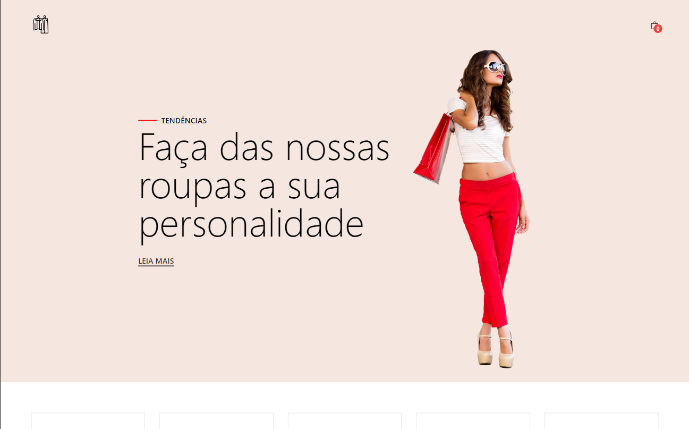
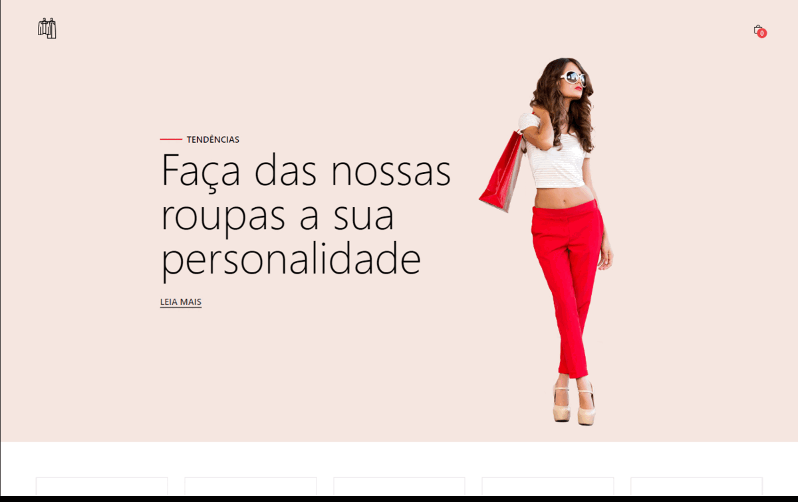

# Loja Virtual Simples
<!--  -->
<div align="center">
  
</div>

<div align="center">
  <h2>Resumo do Projeto</h2>
</div>
<hr>
</br>
<p align='justify'>&emsp;&emsp;&emsp;&emsp;Este projeto é uma loja virtual simples que consiste em três páginas: a página principal, a página de produto individual e a sidebar do carrinho. O objetivo do projeto é fornecer uma interface de compras fácil e intuitiva para os usuários. A página principal apresenta os produtos em destaque, enquanto a página do produto individual mostra informações detalhadas sobre o produto selecionado. A sidebar do carrinho exibe o carrinho atual do usuário, permitindo que eles vejam os itens adicionados e atualizem a quantidade ou removam itens conforme necessário. O design do site é minimalista e fácil de navegar, proporcionando uma experiência de compras tranquila e sem complicações.</p>


</br>


## Índice
- <a href="#funcionalidades">Funcionalidades do projeto</a>
- <a href="#layout">Layout<a>
- <a href="#tecnologias">Tecnologias utilizadas</a>
- <a href="#demonstracao">Demonstração</a>
- <a href="#rodar-projeto">Como rodar esse projeto</a>
- <a href="#autor">Autor</a>

## Funcionalidades do projeto
  - A loja virtual contém as seguintes funcionalidades:
    - [x] Grid com todos os produtos, permitindo a visualização ou adição do mesmo no carrinho.
    - [x] Permite o usuário ter acesso a página individual de cada um dos produtos.
    - [x] Sidebar do carrinho com a visualização dos produtos adicionados. 
    - [x] Adição e remoção de produtos ao carrinho.
    - [x] Aumentar e diminuir a quantidade do produto selecionado.
    - [x] Remover todos os itens do carrinho.
    - [x] Site responsivo

</br>

## Layout

<div align="center">
  
</div>
</br>


## Tecnologias Usadas


</br>


## Demonstração
Acesse o deploy do projeto por aqui:<br>
[Link Demonstração](https://ecommerce-shop-reacttt.netlify.app/)

</br>

## Como rodar esse Projeto
Você pode clonar o repositório através do terminal da sua máquina usando:

```bash
# Clone o repositório na sua máquina
$ git clone https://github.com/mayconndouglass/simple-website-ecommerce-react.git

# Entre na pasta do projeto através do terminal
$ cd pasta-do-projeto

# Instale as dependências
$ npm install

# Rode o projeto
$ npm run dev
```

</br>

## Autor
<div align='center'>Maycon Douglas</div>
